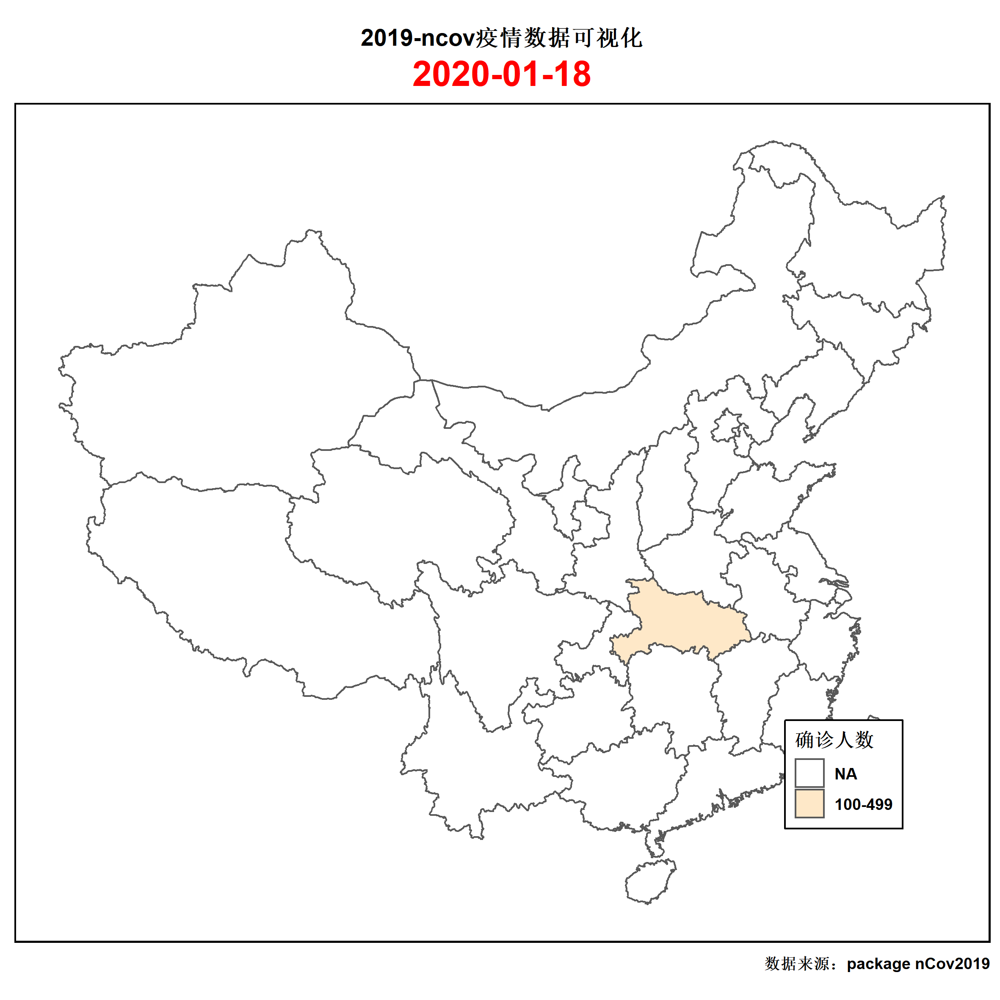
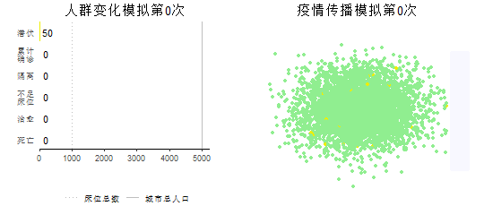
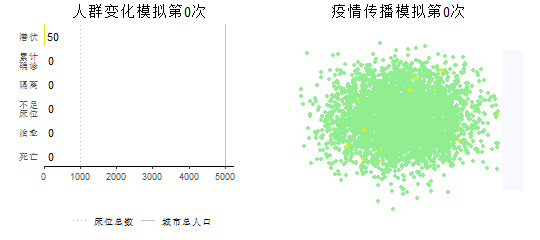

<body bgcolor="#D1EEEE"></body>

```{r echo=FALSE, warning=FALSE,message=FALSE}
missscu <- function(theday = "2020-01-20"){
    today <- Sys.Date()
    days <- today - as.Date(theday)
    paste0("今天是我离开学校的第",days,"天")
}
    
missscu()
```

<font color=blue>nCov2019包绘制图片</font>
```{r echo=FALSE, warning=FALSE,message=FALSE}
library(nCov2019)
library(ggplot2)
library(treemapify)
x <- get_nCov2019()
d  <-  x['湖北',]
options(device = function(file, width = 7, height = 7, ...) {
  windows(width = width, height = height, ...)
})
ggplot(d, aes(area = dead, fill = name, label = paste(name, dead, sep = "\n"))) +
  geom_treemap() +
  geom_treemap_text(fontface = "italic", colour = "white", place = "centre",grow = TRUE)

```


## 世界疫情确诊人数（可缩放）
```{r echo=FALSE, warning=FALSE,message=FALSE}
library(nCov2019)
library(leaflet)
library(dplyr)
library(plotly)
library(scales)
library(xts)
library(dygraphs)
library(corrplot)
library(lubridate)
library(fmsb)
library(forecast)
library(tidyverse)
library(maps)
library(viridis)
library(readr)
library(gapminder)
library(gganimate)

COVID<-read.csv("covid_19_data.csv")
COVID_2<-read.csv("COVID19_15-Apr.csv")
Date<-as.Date(COVID_2$Date, format="%m/%d/%y") 

COVID_2$Date2<-Date
COVID_updated<-COVID_2 %>% filter(Date2==max(Date2))
leaflet(width = "100%") %>% 
  addProviderTiles("Esri.WorldStreetMap") %>% 
  setView(lng = 0, lat = 10, zoom = 1.5) %>% 
  addCircleMarkers(data = COVID_updated, 
                   lng = ~ Long,
                   lat = ~ Lat,
                   radius = ~ log(Confirmed+1),
                   color = rgb(218/255,65/255,56/255),
                   fillOpacity = ~ ifelse(Confirmed > 0, 1, 0),
                   stroke = FALSE,
                   label = ~ paste(Province.State,",",Country.Region, ": ", Confirmed)
                   )
```

## 三维图
```{r echo=FALSE, warning=FALSE,message=FALSE}
fig <- plot_ly(COVID_updated, x = ~Confirmed, y = ~Deaths, z = ~Recovered, width=750) %>% 
  add_markers(text= ~Country.Region ,hoverinfo= "text",
              marker = list(color=rgb(189/255,55/255,48/255))) %>% 
  layout(title="Confirmed cases Vs. Deaths Vs. Recovered", scene = list(
                    xaxis = list(title = 'Confirmed'),
                     yaxis = list(title = 'Deaths'),
                     zaxis = list(title = 'Recovered'))) 
fig
```

## 点状图
```{r echo=FALSE, warning=FALSE,message=FALSE}
COVID_2_Day<- COVID_2 %>% group_by(Date2) %>% summarise(World_confirmed=sum(Confirmed),
                                                        World_deaths=sum(Deaths),
                                                        World_recovered=sum(Recovered))


COVID_Day_confirmed_series<-xts(COVID_2_Day$World_confirmed, order.by=COVID_2_Day$Date2)
COVID_Day_deaths_series<-xts(COVID_2_Day$World_deaths, order.by=COVID_2_Day$Date2)
COVID_Day_recovered_series<-xts(COVID_2_Day$World_recovered, order.by=COVID_2_Day$Date2)

Day_summary<-cbind(COVID_Day_confirmed_series,COVID_Day_deaths_series,COVID_Day_recovered_series)

dygraph(Day_summary, main = "SARS-COV2-outbreak: Total worldwide cases", 
        xlab="Date", ylab="Total cases",width = 750) %>% 
  dySeries("COVID_Day_confirmed_series", "Total cases",drawPoints = TRUE, 
           pointSize = 3, color=rgb(53/255,116/255,199/255)) %>% 
  dySeries("COVID_Day_deaths_series", "Total deaths",drawPoints = TRUE, 
           pointSize = 3, color=rgb(189/255,55/255,48/255)) %>% 
  dySeries("COVID_Day_recovered_series", "Total recovered",drawPoints = TRUE, 
           pointSize = 3, color=rgb(69/255,136/255,51/255)) %>% 
  dyRangeSelector()
```


<font color=gray size=4 face="微软雅黑"><center><p>下列图片为从GitHub的COVID19包上读取的图片，可通过更改日期，选择观看当日全球确诊、治愈、死亡人数分布</p></center></font>

## 6月25号世界确诊人数分布
```{r echo=FALSE,warning=FALSE,message=FALSE}
library(sf)
library(tmap)
library(rnaturalearth)
#确诊病例的数据
Confirmed <- read_csv(url("https://raw.githubusercontent.com/CSSEGISandData/COVID-19/master/csse_covid_19_data/csse_covid_19_time_series/time_series_covid19_confirmed_global.csv"))

Confirmed_Newest<- dplyr::select(Confirmed, `Province/State`, `Country/Region`, Lat, Long,`6/25/20`)

#死亡病例的数据
Deaths <- read_csv(url("https://raw.githubusercontent.com/CSSEGISandData/COVID-19/master/csse_covid_19_data/csse_covid_19_time_series/time_series_covid19_deaths_global.csv"))
#治愈病例的数据
Recovered <- read_csv(url("https://raw.githubusercontent.com/CSSEGISandData/COVID-19/master/csse_covid_19_data/csse_covid_19_time_series/time_series_covid19_recovered_global.csv"))
#确诊病例数据整理
Confirmed_R <- Confirmed %>%
  group_by(`Country/Region`) %>%
  summarise(Confirmed = sum(`6/25/20`, na.rm = TRUE)) %>%
  rename(Region = `Country/Region`)


#死亡病例数据整理
Deaths_R <- Deaths %>%
  group_by(`Country/Region`) %>%
  summarise(Deaths = sum(`6/25/20`, na.rm = TRUE)) %>%
  rename(Region = `Country/Region`)

#治愈病例数据整理
Recovered_R <- Recovered %>%
  group_by(`Country/Region`) %>%
  summarise(Recovered = sum(`6/25/20`, na.rm = TRUE)) %>%
  rename(Region = `Country/Region`)

  comb <-Confirmed_R %>%  
  left_join(Deaths_R, by = "Region")%>%  
  left_join(Recovered_R, by ="Region")
  
  comb <- comb %>%
  mutate(Region = replace(Region, Region == "US", "United States")) %>%
  mutate(Region = replace(Region, Region == "Korea, South", "Korea"))
  
W <- ne_countries(scale = 110, type = "countries", continent = NULL,
                  country = NULL, geounit = NULL, sovereignty = NULL,
                  returnclass = c("sf"))
cov_world <- left_join(W, comb, by = c("name" = "Region")) %>%
  replace_na(list(Confirmed=0, Deaths=0, Recovered=0))
breaks <- c(0, 1, 10, 100, 1000, 10000, 100000)
tm_shape(cov_world) +
  tm_polygons(col="Confirmed", breaks=breaks, title="Confirmed cases", palette="Purples") +
  tm_legend(position=c("left", "centre"))
```


## 6月25号世界治愈人数分布
<body   style="overflow-y:visible">
```{r echo=FALSE,warning=FALSE,message=FALSE}
tm_shape(cov_world) +
  tm_polygons(col="Deaths", breaks=breaks, title="Death cases", palette="Reds") +
  tm_legend(position=c("left", "centre"))
```

## 6月25号世界死亡人数分布
```{r echo=FALSE,warning=FALSE,message=FALSE}
tm_shape(cov_world) +
  tm_polygons(col="Recovered", breaks=breaks, title="Recovered cases", palette="Greens") +
  tm_legend(position=c("left", "centre"))
```


## 全球大部分地区6月25号确诊人数
```{r echo=FALSE, warning=FALSE,message=FALSE}
leaflet(width = "100%") %>% 
  addProviderTiles("Stamen.Toner") %>% 
  setView(lng = 0, lat = 10, zoom = 1.5) %>% 
  addCircleMarkers(data = Confirmed_Newest, 
                   lng = ~ Long,
                   lat = ~ Lat,
                   radius = ~ log(`6/25/20`),
                   color = rgb(218/255,65/255,56/255),
                    fillOpacity = ~ ifelse(`6/25/20` > 0, 1, 0),
                   stroke = FALSE,
                   label = ~ paste(`Province/State`, ",", `Country/Region`, ": ", `6/25/20`)
                   )
```

## 1月18号-2月6号国内疫情动态图
```{r img50, fig.cap='', out.width='50%', fig.align='center', echo=FALSE}

```

<font color=gray size=4 face="微软雅黑"><center><p>下图分别为为以国内疫情爆发初期确诊人数预估公式进行三百次演算生成的在人群随意移动移动和得到控制情况下疫情传播动图</p></center></font>

<font color=gray size=5 face="微软雅黑"><center>当人们随意移动时</center></font>
```{r img51, fig.cap='', out.width='50%', fig.align='center', echo=FALSE}

```

<font color=gray size=5 face="微软雅黑"><center>当人们控制自己移动时</center></font>
```{r img52, fig.cap='', out.width='50%', fig.align='center', echo=FALSE}

```